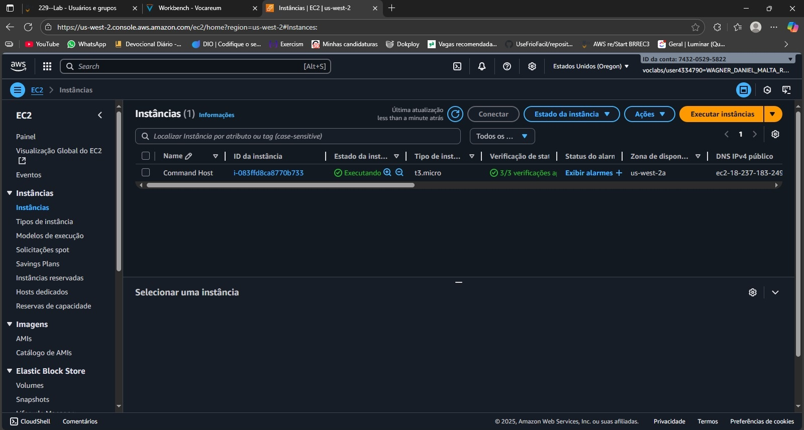
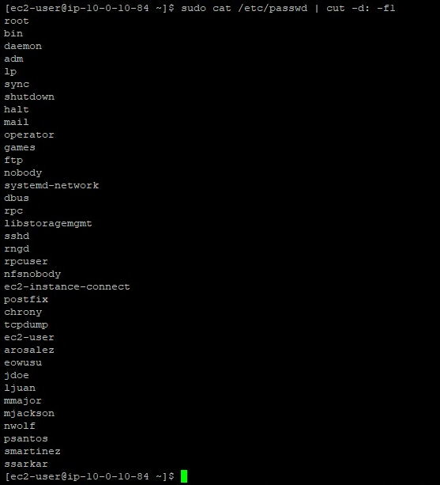
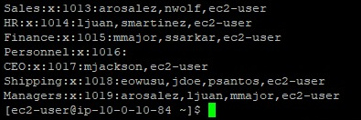
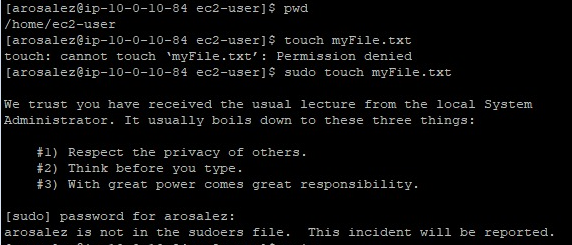
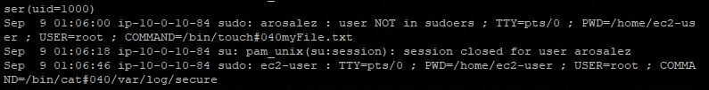

# 🖥️ Laboratório AWS: EC2 + Usuários, Grupos e Auditoria de Sudo

Este repositório documenta um **laboratório prático** realizado na **Amazon Web Services (AWS)** usando uma instância **EC2 Linux**.  
Objetivo: criar usuários e grupos, testar permissões com um usuário **sem privilégios de sudo** e **auditar os logs de segurança** para comprovar a tentativa sem permissão.

---

## 📌 Resumo do que foi feito
- 🚀 Subida de uma instância **EC2** (Amazon Linux).  
- 👤 **Criação de usuário** (ex.: `arosalez`).  
- 👥 **Criação de grupos** e associação de usuários.  
- 🔒 **Teste de segurança**: tentativa de `sudo touch myFile.txt` com usuário sem permissão → erro esperado.  
- 📝 **Análise de logs** no `/var/log/secure` para confirmar o evento.

---

## 🧩 Passo a passo (com imagens)

### 1️⃣ Subir a instância EC2
- Inicie uma instância **t2.micro/t3.micro** (Free Tier) com Security Group liberando **SSH (22)** para seu IP.  
- Conecte via SSH como `ec2-user`.

---

### 2️⃣ Verificar contexto inicial
- `[ec2-user]$ pwd`  
  /home/ec2-user

---

### 3️⃣ Criar usuário
- `sudo useradd arosalez`  
- `sudo passwd arosalez`

Listar usuários (somente nomes):  
- `sudo cat /etc/passwd | cut -d: -f1`

---

### 4️⃣ Criar grupos e listar
- `sudo groupadd Sales`  
- `sudo cat /etc/group`

---

### 5️⃣ Adicionar usuário ao grupo
- `sudo usermod -a -G Sales arosalez`  
- `groups arosalez`

---

### 6️⃣ Testar segurança (usuário sem sudo)
Trocar para o usuário e tentar um comando com sudo:  
- `su arosalez`  
- `sudo touch myFile.txt`

Voltar para o usuário anterior:  
- `exit`

---

### 7️⃣ Auditar logs de segurança
- `sudo cat /var/log/secure`

Registro encontrado:  
- `sudo: arosalez : user NOT in sudoers ; TTY=pts/0 ; PWD=/home/ec2-user ; USER=root ; COMMAND=/bin/touch#040myFile.txt`

> O `#040` representa um espaço no log, confirmando que o comando real foi `touch myFile.txt`.

---

## 🛠️ Principais comandos usados
- `[ec2-user]$ pwd`  
  /home/ec2-user  
- `sudo useradd arosalez`  
- `sudo passwd arosalez`  
- `sudo cat /etc/passwd | cut -d: -f1`  
- `sudo groupadd Sales`  
- `sudo cat /etc/group`  
- `sudo usermod -a -G Sales arosalez`  
- `su arosalez`  
- `exit`  
- `sudo cat /var/log/secure`  
- `sudo touch myFile.txt`

---

## 🧹 Limpeza (opcional)
- `exit`  
- `sudo userdel -r arosalez`  
- `sudo groupdel Sales`

Encerrar a instância EC2 quando não estiver mais usando.

---

## ✅ Observações finais
Este laboratório demonstra **princípios de mínimo privilégio** e **auditoria** em uma instância EC2 Linux.  
O usuário `arosalez` **não** foi incluído no sudoers, resultando no erro esperado ao tentar `sudo touch myFile.txt`, e o evento ficou devidamente **registrado nos logs**.
