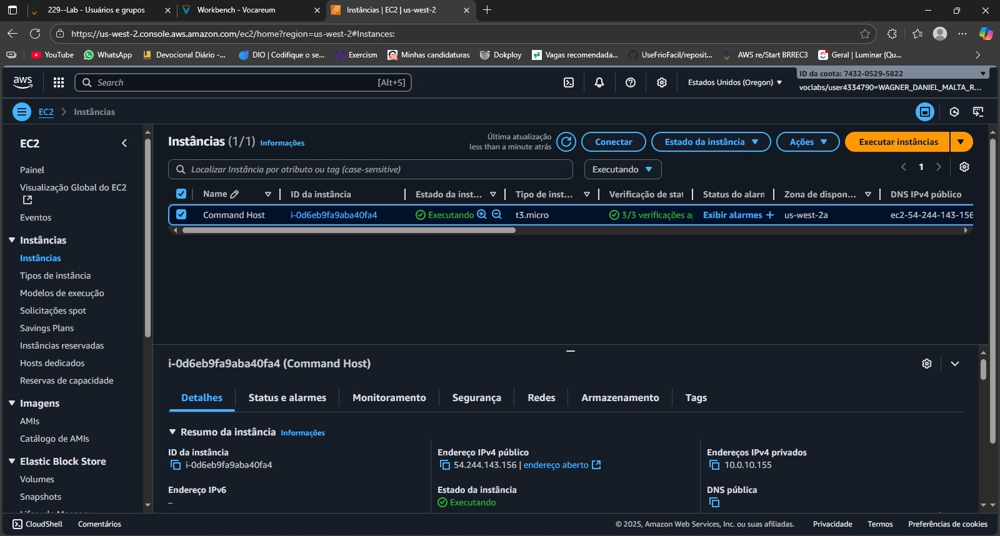
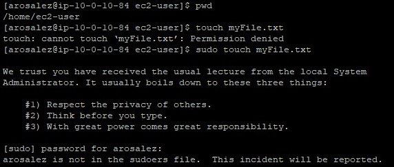

# Laboratório AWS: EC2 + Usuários, Grupos e Auditoria de Sudo

Este repositório documenta, passo a passo, um laboratório realizado na **Amazon Web Services (AWS)** usando uma instância **EC2** com Linux. O objetivo foi criar usuários e grupos, testar permissões (com um usuário **sem** privilégios de sudo), e **auditar os logs de segurança** para comprovar a tentativa sem permissão.

> **Resumo do que foi feito**
>
> * Subida de uma instância **EC2** (Amazon Linux).
> * **Criação de usuário** (ex.: `arosalez`).
> * **Criação de grupos** e associação de usuários aos grupos.
> * **Teste de segurança**: tentativa de `sudo touch myFile.txt` com usuário sem permissão → erro esperado.
> * **Análise de logs** no `/var/log/secure` para confirmar o evento.

---

## Passo a passo (com imagens)

### 1) Subir a instância EC2

* Inicie uma instância EC2 (Amazon Linux), tipo t2.micro/t3.micro (Free Tier elegível), com Security Group liberando **SSH (22)** para seu IP.
* Conecte via SSH como `ec2-user`.




### 2) Verificar contexto inicial

```bash
[ec2-user]$ pwd
/home/ec2-user
```

### 3) Criar usuário

```bash
sudo useradd arosalez
sudo passwd arosalez
```

Listar usuários (somente nomes):

```bash
sudo cat /etc/passwd | cut -d: -f1
```


### 4) Criar grupos e listar

```bash
sudo groupadd Sales
sudo cat /etc/group
```


### 5) Adicionar usuário ao(s) grupo(s)

```bash
sudo usermod -a -G Sales arosalez
groups arosalez
```

### 6) Testar segurança (usuário sem sudo)

Trocar para o usuário:

```bash
su arosalez
sudo touch myFile.txt
```



Voltar para o usuário anterior:

```bash
exit
```

### 7) Auditar logs de segurança

```bash
sudo cat /var/log/secure
```


```
sudo: arosalez : user NOT in sudoers ; TTY=pts/0 ; PWD=/home/ec2-user ; USER=root ; COMMAND=/bin/touch#040myFile.txt
```

> O `#040` representa um espaço no log, então o comando era realmente: `touch myFile.txt`

---

## Principais comandos usados

```bash
[ec2-user]$ pwd
/home/ec2-user

sudo useradd arosalez
sudo passwd arosalez

sudo cat /etc/passwd | cut -d: -f1

sudo groupadd Sales

sudo cat /etc/group

sudo usermod -a -G Sales arosalez

su arosalez

exit

sudo cat /var/log/secure

sudo touch myFile.txt
```

---

## Limpeza (opcional)

```bash
exit
sudo userdel -r arosalez
sudo groupdel Sales
```

Encerrar a instância EC2 quando não estiver mais usando.

---

## Observações finais

Este laboratório demonstra **princípios de mínimo privilégio** e **auditoria** no Linux em uma EC2. O usuário `arosalez` **não** foi incluído no sudoers, resultando no erro esperado ao tentar `sudo touch myFile.txt`, e o evento ficou devidamente **registrado nos logs**.
